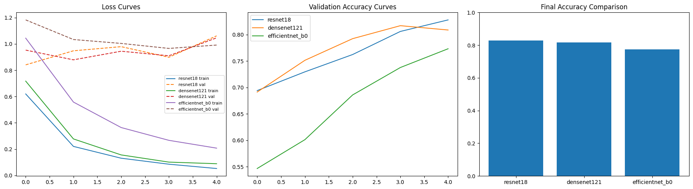
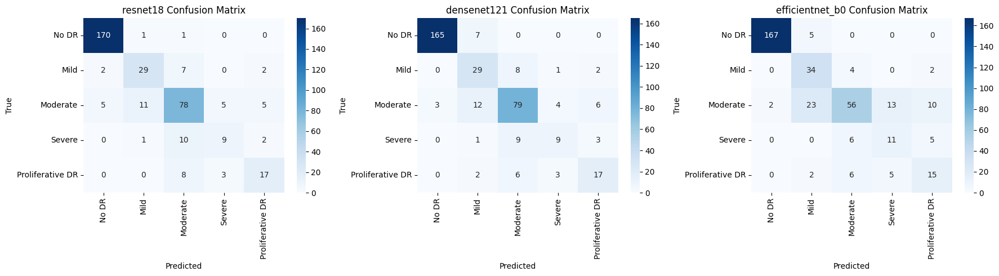
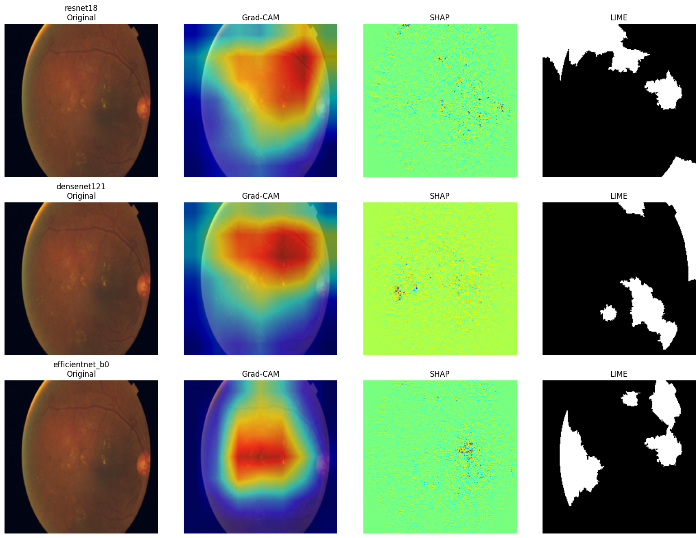
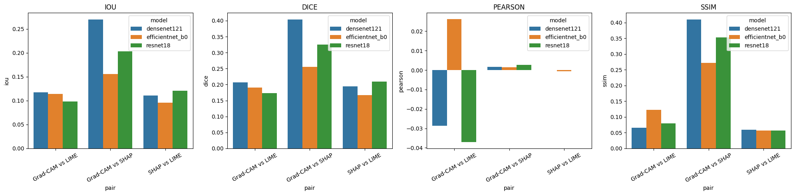
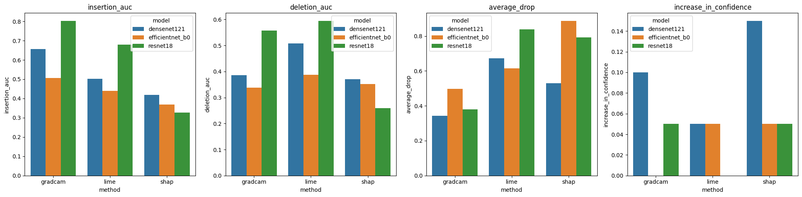

# Deep Learning and Explainable AI for Diabetic Retinopathy Classification
An end-to-end research pipeline that trains three CNN architectures on diabetic retinopathy detection (APTOS 2019 dataset), then quantitatively evaluates three explainability methods (Grad-CAM, SHAP, LIME) measuring both their similarity with each other and their faithfulness to the model's actual decision-making process.

## Problem it addresses
Deep learning models used in medical diagnosis are black boxes. Explainability methods like Grad-CAM, SHAP, and LIME are meant to build clinical trust, but simply visualizing their outputs doesn't establish whether they agree with each other or whether they are actually faithful to the model's decision, this project measures both, quantitatively.

## Dataset
[APTOS 2019 Blindness Detection](https://www.kaggle.com/c/aptos2019-blindness-detection)-retinal fundus images labeled across 5 severity classes: No DR, Mild, Moderate, Severe, and Proliferative DR. 2,930 training images, 366 validation images.

## Pipeline

**Phase 1: Robust training**
- Trained three architectures with transfer learning: ResNet18, DenseNet121, EfficientNet-B0
- Addressed class imbalance (No DR: 1,434 images vs. Severe: 154 images) using a `WeightedRandomSampler` and class-weighted `CrossEntropyLoss`
- Used `ReduceLROnPlateau` learning rate scheduling and early stopping (best model selected by validation accuracy) to avoid overfitting
- Evaluated with Accuracy, Precision, Recall, F1, Confusion Matrix, Classification Report, and multiclass ROC-AUC (one-vs-rest)

**Phase 2: Explainability**
- Applied Grad-CAM, SHAP (GradientExplainer), and LIME to each trained model on a held-out set of test images

**Phase 3: Quantitative agreement between methods**
- Measured pairwise agreement between Grad-CAM, SHAP, and LIME using IoU, Dice coefficient, Pearson correlation, and SSIM

**Phase 4: Faithfulness evaluation**
- Measured whether each explanation method's highlighted region actually reflects the model's decision, using Insertion AUC, Deletion AUC, Average Drop, and Increase in Confidence

## Results

### Model performance

| Model | Accuracy | Precision | Recall | F1 | ROC-AUC |
|---|---|---|---|---|---|
| ResNet18 | 82.8% | 0.822 | 0.828 | 0.824 | 0.923 |
| DenseNet121 | 81.7% | 0.822 | 0.817 | 0.818 | **0.927** |
| EfficientNet-B0 | 77.3% | 0.802 | 0.773 | 0.777 | 0.891 |

ResNet18 achieved the highest overall accuracy, while DenseNet121 achieved the highest ROC-AUC. All three models performed strongly on the majority "No DR" class (96–99% precision) but showed reduced performance on minority classes (Severe, Proliferative DR), consistent with the underlying class imbalance despite reweighting.

*Loss curves, validation accuracy curves, and final accuracy comparison across ResNet18, DenseNet121, and EfficientNet-B0.*

*Per-class confusion matrices showing strong performance on "No DR" and reduced performance on minority classes (Severe, Proliferative DR).*

### Explanation visualizations

*Example explanations for a single test image across all three models. Grad-CAM produces the most spatially coherent, human-interpretable maps.*

### Explanation Method Similarity (IoU, averaged across models)

Similarity between Grad-CAM, SHAP, and LIME was generally **low to moderate** (IoU ranging 0.10–0.27 across model/method pairs), with Grad-CAM vs. SHAP showing the strongest overlap (IoU ≈ 0.20–0.27) and SHAP vs. LIME the weakest (IoU ≈ 0.10–0.12).

### Faithfulness (averaged across models)

| Method | Insertion AUC (higher = better) | Deletion AUC (lower = better) | Average Drop (lower = better) |
|---|---|---|---|
| **Grad-CAM** | Highest (up to 0.80 for ResNet18) | Competitive | Lowest (best) |
| LIME | Moderate | Moderate | High |
| SHAP | Lowest | Competitive | Highest (worst) |

### Key finding
Grad-CAM was consistently the most faithful explanation method across all three architectures, with its highlighted regions contributing most to the model's actual predictions. However, similarity between explanation methods did not correlate with faithfulness. Although Grad-CAM was the most reliable method, its overlap (IoU) with SHAP and LIME remained modest. This suggests that high visual similarity between explanation methods is not a reliable indicator of their trustworthiness; faithfulness should be evaluated directly rather than inferred from similarity or consensus.
